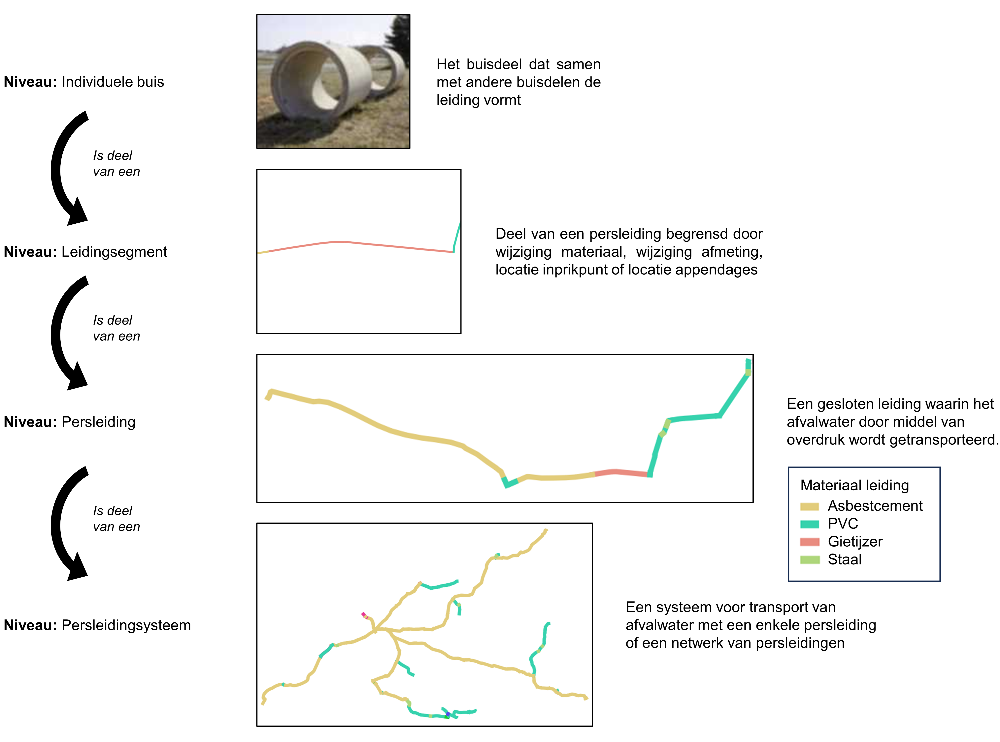
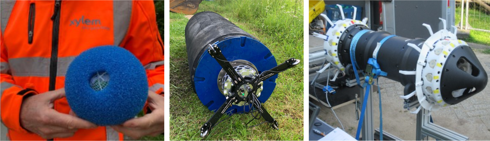

<!--- Markdown viewer:https://markdownlivepreview.com/
Table generator: https://www.tablesgenerator.com/markdown_tables
 -->

# GWSW Persleidingen

De module GWSW-Persleidingen is ontwikkeld door Johan Post (Partners4UrbanWater) en Wouter van Riel (Infralytics), in samenwerking met de werkgroep GWSW-Persleidingen, bestaande uit:
- Frans Hamers, Waterschap Aa en Maas
- Theo Heimensen, Waterschap Vallei en Veluwe
- Werner Jousma, Acquaint
- Roland Markus, Xylem
- Demas Poldervaart, Gemeente Rotterdam
- Thomas Staverman, Waternet
- Michiel Tukker, Deltares
- Sjaak Verkerk, Antea Group
- Paul van Wetten, Hoogheemraadschap van Rijnland

Vanuit Stichting RIONED is Eric Oosterom de verantwoordelijk projectmanager. Vragen over de module en de totstandkoming en vaststelling ervan kunt u stellen via gwsw@rioned.org. 

# Inleiding
<!---Context, GWSW-project -->
Een groot deel van de persleidingen in Nederland is aangelegd in de jaren 70 en 80, toen RWZI’s op grote schaal werden gebouwd. Deze leidingen hebben jarenlang gefunctioneerd zonder veel problemen, waardoor het beheer zich beperkte tot voornamelijk reparaties na een incident. Nu veel persleidingen hun theoretische levensduur naderen of reeds zijn gepasseerd, is er behoefte aan inzicht in de actuele leidingconditie en een schatting van de resterende levensduur. Data spelen hierin een steeds prominentere rol: enerzijds omdat op basis van leidinggegevens kan worden bepaald welke leidingen risicovol zijn en aandacht behoeven, anderzijds omdat metingen en inspecties nieuwe gegevens opleveren die ook vastgelegd en uitgewisseld moeten worden. Naast constructieve aspecten worden voor hydraulische berekeningen van de afvoercapaciteit of drukextremen eveneens gegevens uitgewisseld.

Het GegevensWoordenboek Stedelijk Water ([GWSW](https://data.gwsw.nl/)) s een open standaard, ontwikkeld en beheerd door Stichting RIONED namens de sector. De beoogde meerwaarde van ‘allemaal dezelfde taal spreken’ is een verbetering van de kwaliteit van gegevens en van de uitwisseling ervan. Gangbare stedelijk-waterobjecten en -structuren zijn reeds beschreven in het deelmodel GWSW-Basis. Daarnaast zijn verschillende andere deelmodellen ontwikkeld of in ontwikkeling, die toegespitst zijn op specifieke toepassingen. Gezien de recente ontwikkelingen op het gebied van persleidingen — sinds ca. 2018 verenigd in de 'Werkgroep Persleidingen' onder leiding van Stichting RIONED en STOWA — heeft Stichting RIONED besloten nu ook een deelmodel Persleidingen te definiëren.

# Beoogde toepassingen
Voor het beheer van persleidingen worden data steeds relevanter. Het GWSW is gericht op het verbeteren van de datakwaliteit, -uitwisseling en -benutting. Bij de ontwikkeling van GWSW-Persleidingen zijn de volgende toepassingen als uitgangspunt gebruikt:

**Reactief beheer** 
Bij een leidingbreuk is het zaak maatregelen te nemen om de afvoer van afvalwater te herstellen en de gevolgen voor de omgeving te beperken. Hierbij zijn verschillende informatiebronnen ondersteunend. Uit het persleidingenoverzicht volgt welke achterliggende gemalen afgeschakeld moeten worden en welke afsluiters bediend. Nog voor een schep de grond in is gegaan kan op basis van het toegepaste leidingmateriaal en diameter al worden bepaald welk type reparatie van welk formaat nodig is.

**Risico-inventarisatie** 
Een risico-inventarisatie is een door beheerders veelgebruikt middel voor vervangingsbesluitvorming of het prioriteren van inspecties en leidingconditiemetingen. Om risico's te duiden worden gegevens over de kans op een faalgebeurtenis en de mogelijke gevolgen geïnventariseerd. De gevolg-kant kent twee aspecten, namelijk de kwetsbaarheid van de omgeving (nabijgelegen waterkeringen, andere leidingen, etc.) en het achterliggende gebied dat bij een afvoeronderbreking niet meer kan afvoeren. Voor de kans-kant zijn leidingeigenschappen zoals jaar van aanleg, materiaal en historische faalgebeurtenissen relevant. De bruikbaarheid van geregistreerde historische faalgebeurtenissen hangt nauw samen met het detailniveau waarop deze geregistreerd zijn. Zo is het van belang te differentiëren tussen incidenten met een externe oorzaak, zoals graafschade, die niet veroorzaakt wordt door een afnemende leidingsterkte en net zo goed bij nieuwe leidingen kunnen optreden. 

**Voorkomen graafschade** 
Om graafschade te voorkomen wordt informatie over de leidingligging verstrekt aan grondroerders die voornemens zijn graafwerkzaamheden uit te voeren. In de praktijk blijkt dat de nauwkeurigheid van deze liggingsgegevens te wensen overlaat, waardoor de leidingligging in het veld enkele decimeters tot soms zelfs tientallen meters afwijkt van de ligging volgens het beheersysteem. Daarnaast kan de (hoogte)ligging uit verschillende bronnen afkomstig zijn waarbij deze in het beheerbestand steeds wordt overschreven en alleen de laatste beschikbaar is. De kwaliteit en actualiteit van deze gegevens kan worden geduid door deze van een datum en wijze van inwinning (b.v. schatting, ontwerptekening, inmeting, etc.) te voorzien. 

**Toetsen hydraulisch functioneren** 
Hydrodynamische software wordt gebruikt om de hydraulische afvoercapaciteit van persleidingen te toetsen. Naast inzicht in de te verwachten afvoerdebieten kan hiermee ook getoetst worden of luchtophoping een mogelijk knelpunt is en wat de maximaal en minimaal optredende drukken zijn. Het laatste is ook van belang bij het bepalen van de minimaal benodigde resterende buissterkte. Het GWSW kan de gegevensuitwisseling met dergelijke software vereenvoudigen.

**Bepalen actuele leidingconditie en schatten restlevensduur** 
Bij inspecties en leidingconditiemetingen worden data over leidingkenmerken zoals de wanddikte, hoekverdraaiing of ligging gegenereerd. Wanneer uit een toetsing aan de maatstaven volgt dat de leiding niet voldoet, dient deze vervangen te worden. Voor een dergelijke toetsing dienen dus zowel de conditiemetingen als de maatstaven vastgelegd te zijn. 

Veel beheerders gebruiken conditiemetingen ook om de restlevensduur te schatten, waarbij metingen worden vergeleken met de aanlegsituatie en de gemeten degradatiesnelheid wordt geprojecteerd op de toekomst (zie ook Figuur 3.1). Dergelijke restlevensduurschattingen zijn alleen mogelijk wanneer oude gegevens niet overschreven worden, maar naast elkaar bewaard.

*Figuur 3.1 - Schematische weergave van leidingdegradatie over de tijd, tot een ingrijpmaatstaf bereikt is. Wanneer de degradatiesnelheid bekend is, kan een schatting worden gemaakt hoelang het duurt voordat de ingrijpmaatstaf bereikt is.* 

<!---Applicaties (extern en/of op GWSW Server) Gegevensbehoefte-->

# Nieuw in GWSW persleidingen
In dit hoofdstuk is vanuit een beheerdersperspectief beschreven wat de belangrijkste vernieuwingen aan het GWSW zijn. In hoofdstuk 4 is per onderdeel in detail uitgewerkt welke modelconcepten aangepast of toevoegt zijn.

**Vaste data over persleidingen** 
Het zwaartepunt van GWSW persleidingen ligt op de vaste gegevens van persleidingen. Denk hierbij bijvoorbeeld aan leidingmateriaal of wanddikte, maar ook kenmerken die nodig zijn om hydrodynamische berekeningen uit te voeren. Appendages zoals ontluchters en afsluiters vallen ook binnen de scope. De vaste gegevens zijn reeds deels gespecificeerd in het huidige GWSW. In deze module zijn onvolledige modelconcepten aangepast en missende concepten toegevoegd.

**Gegevens op verschillende detailniveaus** 
Waar persleidinggegevens eerder alleen nog op persleiding- of leidingsegmentniveau werden vastgelegd (zie ook Figuur 3.2), worden met de komst van nieuwe inspectietechnieken ook steeds meer gegevens op buisniveau geregistreerd. GWSW persleidingen kan met gegevens op alle detailniveaus in Figuur 3.2 omgaan, door steeds de onderlinge relaties tussen de niveaus te registreren: dus een buisdeel is onderdeel van een leidingsegment, wat weer onderdeel is van een persleiding, etc. Hierdoor zijn gegevens met een verschillend detailniveau toch aan elkaar te relateren. Voorbeeld hiervan is het koppelen van een uitwendige radarmeting van een buisdeel aan beheerdata van de gemeente op persleidingniveau.

*Figuur 3.2 - Verschillende niveaus waarop gegevens over persleidingen worden vastgelegd* 

**Leiding volgen over de gehele levensduur** 
Bij het berekenen van de restlevensduur van een leiding is het niet alleen van belang de huidige conditie te weten, maar ook te bepalen hoe snel degradatieprocessen zoals zetting of aantasting in de tijd gaan. De degradatiesnelheid kan vervolgens geprojecteerd worden om te schatten binnen hoeveel jaar de leiding 'op' is. Binnen GWSW persleidingen kunnen meerdere historische metingen van een leidingkenmerk naast elkaar bestaan, waarmee voorkomen wordt dat de nieuwste meetwaarden de oude overschrijven en gegevens verloren gaan.

Een voorbeeld hiervan is opgenomen in Tabel 3.1, waarbij meerdere diepteliggingen van een persleiding in zettingsgevoelig gebied bekend zijn. Het gaat hierbij om de oorspronkelijke diepte tijdens aanleg en twee metingen na 25 en 51 jaar. Op basis van deze metingen is af te leiden dat de gemiddelde zettingssnelheid 1,4 mm / jaar is.

*Tabel 3.1 - Voorbeeld van een object waarvan de drie verschillende diepteliggingen zijn vastgelegd* 

| **Objectnaam** | **Diepteligging (z-coördinaat)** | **Wijze van inwinning** | **Datum van inwinning** |
|----------------|----------------------------------|-------------------------|-------------------------|
| xx_1      | 11,73 m NAP           | Revisie         | 01-01-1971       |
| xx_1      | 11,68 m NAP           | GPS Landmeting     | 12-07-1996       |
| xx_1      | 11,66 m NAP           | Inspectie        | 06-08-2022       |

**Persleidingincidenten** 
De STandaard voor Uniforme Incidentenregistratie Persleidingen (STUIP) van Stichting RIONED / STOWA is als onderdeel van GWSW persleidingen opgenomen. Deze standaard beschrijft welke aspecten van een persleidingincident vastgelegd moeten worden om tot een bruikbare informatiebron voor risicogestuurd beheer te komen.

# Datamodel
Tabel 4.1 geeft een overzicht van de bestaande concepten in GWSW basis die over persleidingen gaan, zie ook [https://data.gwsw.nl/1.5.2/Basis/Persleiding](https://data.gwsw.nl/?menu_item=classes&item=../../def/1.5.2/Basis/Persleiding). Hier is bewust de keuze gemaakt om geen van de kenmerken verplicht te stellen, waardoor ook van persleidingen met een incompleet leidingdossier gegevens geregistreerd uitgewisseld kunnen worden conform het GWSW. In de rest van dit hoofdstuk is per thema uitgewerkt welke concepten in GWSW persleidingen zijn toegevoegd. Hierbij zijn de volgende thema's gedefinieerd:
- Algemene kenmerken
- Hydraulische aspecten  
- Risico's 
- Persleidinginspecties 
 - Persleidingincidenten

*Tabel 4.1 - Bestaande persleidingconcepten in GWSW basis* 

| **Kenmerk**       | **Waardetype**                                               | **Verplicht veld** | **Toelichting**                                                 |
|-------------------------|------------------------------------------------------------------------------------------------------------|--------------------|------------------------------------------------------------------------------------------------------------------|
| Begindatum       | [yyyymmdd] xsd:date                                            | Nee        | Datum waarop het fysieke object is geplaatst of geinstalleerd                          |
| Breedte leiding     | [mm] xsd:integer                                                    | Nee        | De bij het materiaal gebruikelijke aanduiding van de breedte van een  leiding                  |
| Diameter leiding    | [mm] xsd:integer                                                    | Nee        | De lengte van de middellijn van de cirkel die de binnen- of de  buitenzijde van de leidingdoorsnede beschrijft. |
| Drukklasse       | [bar] xsd:decimal                                                   | Nee        | De maximale druk die de buis van een bepaalde klasse kan weerstaan                        |
| Einddatum        | [yyyymmdd] xsd:date                                            | Nee        | Datum waarop het fysieke object geen onderdeel meer van het fysieke  systeem is                 |
| Hoogte leiding     | [mm] xsd:integer                                                    | Nee        | De bij het materiaal gebruikelijke aanduiding van de hoogte van een  leiding                  |
| Leidingorientatie    | [gml] geo:gmlLiteral                                            | Nee        | Geografische beschrijving van leiding in XY coordinaten, met optioneel Z  coordinaten              |
| Lengte leiding     | [m] xsd:decimal                                              | Nee        |                                                         |
| Materiaal leiding    | gwsw:hasReference [MateriaalLeidingColl] (Asbestcement,    Beton met stalen kern,    etc.)                           | Nee        | De bouwstof van de leiding                                            |
| Revisietekening     | Tekeningnummer                                               | Nee        | Een tekening die na aanleg is opgesteld en in detail de aangelegde  situatie weergeeft             |
| Status functioneren   | gwsw:hasReference [StatusFunctionerenColl] (Buiten gebruik,    In aanleg,    etc.)                    | Nee        |                                                         |
| Toegankelijk      | gwsw:hasReference [ToegankelijkColl] (Alleen toegankelijk voor  apparatuur,    Niet toegankelijk,    etc.) | Nee        | Aanduiding van de toegankelijkheid op basis van constructieve  eigenschappen                  |
| Verbindingstype     | gwsw:hasReference [VerbindingstypeColl] (Flensverbinding,    Glijverbinding,    etc.)                             | Nee        | De wijze waarop de buizen binnen een leiding zijn verbonden                           |
| Verhoogd  risico    | gwsw:hasValue                                                      | Nee        | In kader WION, er geldt een verhoogd risico bij ontgraven voor deze  leiding                  |
| Voegmateriaal      | gwsw:hasReference [VoegmateriaalColl] (Rubberring,    Voegenkit,    etc.)                                  | Nee        | Afdichtingsmateriaal van de buisverbindingen                                   |
| Voorzorgsmaatregel   | gwsw:hasValue                                                      | Nee        | In kader WION, document met bijzondere maatregelen bij ontgraven                         |
| Vorm leiding      | gwsw:hasReference [VormLeidingColl] (Rechthoekig,    Rond,    etc.)                                    | Nee        | De vorm van de dwarsdoorsnede van de leiding                                   |
| Wanddikte        | [mm] xsd:integer xsd:integer                                              | Nee        | Dikte van de wand van de constructie                                       |
| Wandruwheid       | [mm] xsd:integer xsd:integer                                              | Nee        | K-Nikuradse  waarde profielwand                                         |
| Wandruwheid binnenboven | [mm] xsd:integer xsd:integer                                              | Nee        |                                                         |
| Wandruwheid binnenonder | [mm] xsd:integer xsd:integer                                              | Nee        |                                                         |
| Wibon thema       | gwsw:hasReference [WIONThemaColl] (Laagspanning (thema), Middenspanning (thema), etc.)       | Nee        |                                                         |                                               |

[VoegmateriaalColl]: https://data.gwsw.nl/totaal/?menu_item=individuals&item=../../def/1.6.1/Totaal/VoegmateriaalColl
[MateriaalLeidingColl]: https://data.gwsw.nl/totaal/?menu_item=individuals&item=../../def/1.6.1/Totaal/MateriaalLeidingColl
[StatusFunctionerenColl]: https://data.gwsw.nl/totaal/?menu_item=individuals&item=../../def/1.6.1/Totaal/StatusFunctionerenColl
[ToegankelijkColl]: https://data.gwsw.nl/totaal/?menu_item=individuals&item=../../def/1.6.1/Totaal/ToegankelijkColl
[VerbindingstypeColl]:https://data.gwsw.nl/totaal/?menu_item=individuals&item=../../def/1.6.1/Totaal/VerbindingstypeColl
[VormLeidingColl]: https://data.gwsw.nl/totaal/?menu_item=individuals&item=../../def/1.6.1/Totaal/VormLeidingColl
[WIONThemaColl]: https://data.gwsw.nl/totaal/?menu_item=individuals&item=../../def/1.6.1/Totaal/WIONThemaColl

## Toegevoegde algemene GWSW-concepten
Tabel 4.2 toont een overzicht van de nieuw toegevoegde algemene concepten. Uitgevoerde (lokale) reparaties zoals deelliners, reparatieringen (aquaring) en reparatieklemmen, die deels voor vrijverval leidingen al bestonden, kunnen ook voor persleidingen worden gedefinieerd en voorzien van een oriëntatie zodat deze zichtbaar worden op kaart. Ook kunnen meer details op buisniveau worden gedefinieerd, zoals datum, materiaal, etc., waarmee aangesloten wordt op het niveau waarop inline-inspectietools gegevens verzamelen. Een aantal door de werkgroep genoemde appendages en voorzieningen waren nog niet opgenomen in het GWSW of nog niet specifiek beschikbaar voor persleidingen.

Van inprikkende persleidingen van bedrijven of gemeenten waarvan de persleiding zelf niet in de dataset is opgenomen, kan straks het punt van inprikken worden opgenomen. Deze informatie is nodig om afvalwaterhoeveelheden te berekenen en leidingen veilig droog te zetten tijdens een incident.

*Tabel 4.2 - Algemeen toegevoegde concepten GWSW persleidingen* 

| **Behoefte**                       | **Bestaande situatie** | **Voorstel**     | **Verplicht** | **Toelichting**                                                                                                                                                        |
|----------------------------------------------------------|-----------------------:|----------------------:|---------------|-------------------------------------------------------------------------------------------------------------------------------------------------------------------------------------------------------------------------------------------------------------------------------------------------------------------------------|
| Reparatiestukken toevoegen:  lining           | Deelliner       | Deelliner       | Nee      | Deelliner als concept bestaat  reeds en heeft een oriëntatie, dus kan op kaart worden weergegeven. Concept  was echter alleen beschikbaar voor vrijverval leidingen.                                                                            |
| Reparatiestukken toevoegen:  reparatieklem       | -           | Reparatieklem     | Nee      | Reparatieklem bestond nog niet  als concept.                                                                                                                                         |
| Reparatiestukken toevoegen:  reparatiering       | -           | Reparatiering     | Nee      | Reparatiering bestond nog niet  als concept, Aquaring als synoniem toevoegen.                                                                                                                        |
| Persleiding beschrijven op  buisniveau         | Buisdeel        | Buisdeel       | Nee      | Buisdeel als concept bestaat  reeds, maar was nog niet voorzien van  oriëntatie en kon dus niet op kaart worden weergegeven. Ook miste het  buismateriaal nog.                                                                              |
| Inprikkers op persleidingen  toevoegen         | -           | Inprikker       | Nee      | Het is gewenst de locatie van  (industriële) inprikkers in kaart te brengen. Perceelaansluitpunt bestaat al  en zou grotendeels gekopieerd kunnen worden. Dit concept was al voorzien van  een oriëntatie en kon dus op kaart worden weergegeven. Ook de reeds bestaande  kenmerken zoals lozingseisen zijn van toepassing |
| Verbindingsstukken (Bochtstuk,  T-stuk, etc.) toevoegen | Verbindingsstuk    | Verbindingsstuk    | Nee      | Verbindingsstuk als concept  bestaat reeds en heeft verschillende subtypen zoals bochtstuk en T-stuk. Deze waren nog niet beschikbaar voor persleidingen                                                                                   |
| Missende hulpstukken toevoegen              | Compensator      | Compensator      | Nee      | Compensator als concept bestaat  reeds, maar was nog geen onderdeel van een persleiding                                                                                                                   |
| Missende appendages toevoegen              | Mechanische afsluiter | Mechanische afsluiter |        | Mechanische afsluiter bestaat  reeds, maar was nog geen onderdeel van een persleiding en had geen oriëntatie                                                                                                         |
| Missende  waterslagvoorzieningen toevoegen       | -           | Be-  en ontluchter  | Nee      | Deze waterslagvoorziening was  nog niet opgenomen in het GWSW                                                                                                                                |
|                             | -           | Buffertoren      | Nee      | Deze waterslagvoorziening was  nog niet opgenomen in het GWSW                                                                                                                                |
| Mangat toevoegen                     | Mangat         | Mangat        | Nee      | Mangat als concept bestaat reeds  en heeft een oriëntatie, dus kan op kaart worden weergegeven. Concept was  echter alleen beschikbaar voor druk- en vacuümriolen.                                                                             |
| Toevoegen  of een leiding is voorzien van een beschermende coating               | Coating        | Coating     | Nee      | Concept Coating bestond al, maar  was nog geen kenmerk van een buisdeel, leidingsegment of persleiding |

## Hydraulische aspecten
Voor het uitvoeren van waterslagberekeningen zijn naast de leidinggeometrie en de aanwezige appendages ook gegevens over de drukklasssen van de leidingsegmenten nodig. Voorstel is om ook gemeten drukken zoals de opleveringsdruk en de testdruk toe te voegen. Deze modelconcepten kunnen dienen als maatstaf om naast de uitkomsten van een waterslagberekening te leggen, bijvoorbeeld om te toetsen of de berekende overdruk bij een bepaalt scenario leidt tot overschrijding van de opleveringstestdruk. Voor waterslagberekeningen is het ook mogelijk energieverliescoefficienten voor lokale verliezen bij appendages toe te voegen. Tabel 4.3 geeft een overzicht van de toegevoegde concepten.

*Tabel 4.3 - toegevoegde concepten over hydraulische aspecten* 

| **Behoefte**               | **Bestaande situatie** | **Voorstel**       | **Waardetype** | **Verplicht** | **Toelichting**                                                                        |
|-------------------------------------------|------------------------|---------------------------|-----------------|---------------|----------------------------------------------------------------------------------------------------------------------------------------------------------------|
| Toevoegen verschillende leidingdrukken  | -			       | Druk:           |         | Nee      | Drukklasse als concept bestaat reeds, maar maakte nog geen onderscheid tussen de drukklasse van een buis, de ontwerpdruk van de leiding en gemeten drukken |
|                      |            |  Drukklasse (PN)	   | [bar] xsd:float | Nee      |                                                                                |
|                      |            |  Ontwerpdruk      | [bar] xsd:float | Nee      |                                                                                |
|                      |            |  Opleveringsdruktest  | [bar] xsd:float | Nee      |                                                                                |
|                      |            |  Testdruk        | [bar] xsd:float | Nee      |                                                                                |
| Lokale verliezen bij appendages toevoegen | -           | Energieverliescoefficient | [-]       | Nee      | Energieverlies coëfficiënten  voor lokale verliezen bestond nog niet als concept                                       |

## Risico's
Om te bepalen of een leiding risicovol is gebruiken beheerders naast vaste gegevens zoals de diameter, materiaal en het aanlegjaar, ook gegevens over de modelconcepten uit Tabel 4.4 Zo bepaalt het afvoerend debiet of tijdens calamiteit afvoer per as kan worden georganiseerd of dat een leiding "too big to fail" is. De restlevensduur en de minimaal benodigde wanddikte worden weer gebruikt om iets te zeggen over de kans op falen.

*Tabel 4.4 - Toegevoegde concepten over risico's* 

| **Behoefte**                                           | **Bestaande situatie** | **Voorstel**   | **Waardetype**  | **Verplicht** | **Toelichting**                                             |
|--------------------------------------------------------------------------------------------------|------------------------|------------------|------------------|---------------|---------------------------------------------------------------------------------------------------------|
| Toevoegen  debiet persleiding tijdens dwa / hwa. Vaak bepalend voor de gevolgen van een incident en de mate van opschalen | -           | Afvoerdebiet dwa | [m3/h] xsd:float | Nee      | Kenmerk bestond nog niet                                        |
|                                                 | -           | Afvoerdebiet hwa | [m3/h] xsd:float | Nee      | Kenmerk bestond nog niet                                        |
| Toevoegen  geschatte restlevensduur                               | Restlevensduur     | Restlevensduur  | [yyyy] xsd:gYear | Nee      | Concept restlevensduur bestond  al, maar was nog geen kenmerk van een buisdeel of leidingsegment en niet  voorzien van wijze en datum van inwinning |
| Minimaal  benodigde wanddikte als maatstaf toevoegen  | -           | Minimaal benodigde wanddikte | [mm] xsd:integer  | Nee      | Minimaal benodigde wanddikte  bestond nog niet als concept.                                                                                                                                 |

## Persleidinginspecties
In toenemende mate gebruiken beheerders inline-inspecties om inzicht te krijgen in de actuele leidingtoestand. Figuur 4.1 geeft enkele voorbeelden van beschikbare inline-inspectietechnieken. Naast informatie over de leidingtoestand worden bij dergelijke inspecties ook veel vaste gegevens op buisniveau verzameld. Het uitvoeren van een inspectieproject en het uitwisselen van gegevens wordt gefaciliteerd in GWSW Persleidingen. Een inspectieproject bestaat uit een projectdefinitie met een aantal algemene kenmerken, zie ook Tabel 4.5. Hier kan de opdrachtgever brongegevens over het te inspecteren object aan koppelen en uitwisselen met de opdrachtnemer via een uitwisselingsformat in OroX. 

*Figuur 4.1 - Drie voorbeelden van inline-inspectietechnieken voor persleidingen* 

*Tabel 4.5 - Gegevens Inspectieproject* 
 
| Veldcode            | Omschrijving          | Waardetype | Verplicht | Toelichting   |
| ------------------------------ | ------------------------------- | ---------- | --------- | --------------- |
| Naam              | Naam project          | rdfs:label | Nee    |         |
| ProjectreferentieOpdrachtgever | Projectreferentie Opdrachtgever | rdfs:label | Nee    |         |
| ProjectreferentieOpdrachtnemer | Projectreferentie Opdrachtnemer | rdfs:label | Nee    |         |
| Omschrijving          | Omschrijving project      | rdfs:label | Nee    | opmerkingenveld |
| Opdrachtgever         | Opdrachtgever          | rdfs:label | Ja    |         |
| Opdrachtnemer         | Opdrachtnemer          | rdfs:label | Ja    |         |

Het resultaat van een project zijn gemeten toestandsaspecten en mogelijk ook vaste gegevens waarmee een verouderd of incompleet leidingdossier kan worden aangevuld. Tabel 4.6 geeft een overzicht van de modelconcepten die terug kunnen worden geleverd. Het projectresultaat bevat altijd de vaste gegevens van het geïnspecteerde object retour, optioneel voorzien van geactualiseerde kenmerken over de vaste gegevens. Daarnaast kunnen ook waargenomen toestandsaspecten worden toegevoegd. Een dergelijk toestandsaspect wordt altijd voorzien van een locatieaanduiding, dit kan een klokstand zijn (b.v. 12 uur positie), maar ook de locatiecoördinaten (x, y coördinaten). 

*Tabel 4.6 - Inspectiegegevens persleiding of buisdeel* 

| Veldcode             | Omschrijving            | Waardetype                      | Verplicht | Toelichting                                    |
| -------------------------------- | ---------------------------------- | ----------------------------------------------------- | --------- | --------------------------------------------------------------------------------- |
| Naam               | Naam object            | rdfs:label                      | Nee    | (b.v. Pers_0001)                                 |
| Type               | Objecttype             | rdf:type                       | Ja    | Mechanische transportleiding, buisdeel, ontluchter, etc.             |
| DatumInwinning          | Datum inwinning          | xsd:date                       | Ja    | Datum waarop gegevens verzameld zijn                       |
| WijzeVanInwinning        | Wijze van inwinning        | gwsw:hasReference [WijzeVanInwinningColl]       | Nee    | Wijze waarop gegevens verzameld zijn                       |
| Opmerking            | Opmerkingen            | gwsw:hasValue                      | Nee    | veld voor opmerkingen                               |
| LocatieWaarneming        | Locatie waarneming         | gwsw:hasValue [Punt], [Lijn] of en/of [Omtreklocatie] | Ja    | Locatie van een waarneming. Kan een geografische locatie zijn en/of een klokstand |
| MetingBuigingHorizontaal     | Meting buiging horizontaal     | [m] xsd:decimal                    | Nee    | Meting van de axiale deformatie in horizontale richting              |
| MetingBuigingVerticaal      | Meting buiging verticaal      | [m] xsd:decimal                    | Nee    | Meting van de axiale deformatie in verticale richting               |
| MetingBuigingTotaal       | Meting buiging           | [m] xsd:decimal                    | Nee    | Meting van de axiale deformatie                          |
| WaarnemingDelaminatie      | Waarneming delaminatie       |                            | Nee    | Waarneming van delaminatie, b.v. bij een GVK buisdeel               |
| MetingAantalDraadbreuken     | Meting van het aantal draadbreuken | [pcs] xsd:nonNegativeInteger             | Nee    | Meting van het aantal gebroken wapeningsdraden in een voorgespannen betonbuis   |
| Gasophopingtype         | Type gasophoping          | gwsw:hasReference [GasOphopingtypeColl]        | Nee    | Waargenomen gasophoping in persleiding                      |
| LengteGasophoping        | Lengte gasophoping         | [m] xsd:decimal                    | Nee    | Lengte van een waargenomen gasophoping                      |
| MetingHoekverdraaiingHorizontaal | Meting hoekverdraaiing horizontaal | [DEG] xsd:decimal                   | Nee    | De horizontale hoek tussen de verplaatste assen van twee buizen          |
| MetingHoekverdraaiingVerticaal  | Meting hoekverdraaiing verticaal  | [DEG] xsd:decimal                   | Nee    | De verticale hoek tussen de verplaatste assen van twee buizen           |
| Lekdebiet            | Lekdebiet             | [m3/h] xsd:decimal                  | Nee    | Gemeten lekdebiet tijdens afpersen of een inspectie                |
| Lekkagetype           | Type lekkage            | gwsw:hasReference [LekkagetypeColl]          | Nee    | Lekkageklasse variërend van klein tot groot                    |
| BreedteBuisdeelMeting      | Breedte buisdeel meting      | [mm] xsd:integer: min=63 max=4000           | Nee    | Gemeten breedte van een buisdeel                         |
| HoogteBuisdeelMeting       | Hoogte buisdeel meting       | [mm] xsd:integer: min=63 max=4000           | Nee    | Gemeten hoogte van een buisdeel                          |
| MetenOvaliteit          | Meten ovaliteit          | xsd:decimal: min=0 max=1               | Nee    | Gemeten ovaliteit (niet rondheid) van een buisdeel                |
| WaarnemingVervuiling       | Waarneming vervuiling       |                            | Nee    | Waarneming van vervuiling                             |
| VoegwijdteMeting         | Voegwijdte meting         | [mm] xsd:decimal                   | Nee    | Wijdtemeting van de voeg tussen twee buisdelen                  |
| WanddikteAfnameGemiddeld     | Gemiddelde afname wanddikte    | [mm] xsd:decimal                   | Nee    | Gemeten gemiddelde wanddikteafname                        |
| WanddikteAfnameMaximaal     | Maximale afname wanddikte     | [mm] xsd:decimal                   | Nee    | Gemeten maximale wanddikteafname                         |
| WanddikteAfnameGemiddeld     | Minimale afname wanddikte     | [mm] xsd:decimal                   | Nee    | Gemeten minimale wanddikteafname                         |
| Wanddiktemeting gemiddeld    | Gemiddeld gemeten wanddikte    | [mm] xsd:decimal                   | Nee    | Gemiddeld gemeten wanddikte                            |
| WanddiktemetingMaximaal     | Maximaal gemeten wanddikte     | [mm] xsd:decimal                   | Nee    | Maximaal gemeten wanddikte                            |
| WanddiktemetingMinimaal     | Minimaal gemeten wanddikte     | [mm] xsd:decimal                   | Nee    | Minimaal gemeten wanddikte                            |
| Afwijking            | Waargenomen afwijking wanddikte  | gwsw:hasValue                      | Nee    | Waargenomen wanddikteafwijkingen zoals H2S aantasting of lokale uitloging     |                                       |

[WijzeVanInwinningColl]: https://data.gwsw.nl/Persleidingen/index.html?menu_item=classes&item=./WijzeVanInwinningColl
[Punt]: https://data.gwsw.nl/MateriaalLeidingColl/index.html?menu_item=classes&item=./Punt
[Lijn]: https://data.gwsw.nl/MateriaalLeidingColl/index.html?menu_item=classes&item=./Lijn
[Omtreklocatie]: https://data.gwsw.nl/MateriaalLeidingColl/index.html?menu_item=classes&item=./Omtreklocatie 
[GasOphopingtypeColl]: https://data.gwsw.nl/1.6.1/Persleidingen/index.html?menu_item=individuals&item=../../def/1.6.1/Persleidingen/GasOphopingtypeColl
[LekkagetypeColl]: https://data.gwsw.nl/1.6.1/Persleidingen/index.html?menu_item=individuals&item=../../def/1.6.1/Persleidingen/LekkagetypeColl

Bij het opstellen van Tabel 4.6 is een inline-inspectie als uitgangspunt genomen. De systematiek is echter voldoende flexibel om gegevens van onderzoeksmethoden variërend van inline-inspecties van volledige leidingen tot locatie specifieke boorkernonderzoeken te registeren. Hierbij kunnen meerdere inspecties uitgevoerd door verschillende partijen naast elkaar bestaan zonder dat deze elkaar overschrijven, zodat beheerders kunnen monitoren of de leidingtoestand eerder progressief verslechterd of toch stabiel blijft. Figuur 4.2 (links) geeft een voorbeeld van meerdere typen inline-inspecties uitgevoerd op dezelfde leiding. Waar het oorspronkelijke beheerbestand de leiding beschreef als een aantal leidingsegmenten op basis van de toegepaste materialen en diameters, volgt uit de inspectie een leidingbeschrijving op buisniveau (rechterhelft Figuur 4.2), waar naast vaste gegevens zoals de oorspronkelijke wanddikte, toegepaste materiaal en buisdeellengte ook toestandsaspecten zoals de wanddikteafname zijn toegevoegd. Dit geeft eenvoudig inzicht in delen van een persleiding die er slecht aan toe zijn en delen die in goede staat verkeren.

*Figuur 4.2 - Leidingligging volgens drie verschillende inspecties uitgevoerd in zomer 2024, tezamen met twee historische persleidingincidenten (Links). Voorbeeld van inspectiegegevens op buisniveau (Rechts)* 

## Persleidingincidenten
In opdracht van Stichting RIONED / STOWA is in 2023 een STandaard voor Uniforme Incidentenregistratie Persleidingen (STUIP) opgesteld, met als doel beheerrelevante gegevens van persleidingincidenten vast te leggen zodat deze bruikbaar worden als informatiebron voor risicogestuurd beheer. De volledige rapportage is te raadplegen via deze [link]. In Figuur 4.3 staan de verschillende stappen uit het standaardproces van een persleidingincident, van het waarnemen van een incident tot het uiteindelijk verhelpen en evalueren. 

[Link]: https://www.stowa.nl/publicaties/registreren-van-persleidingen-voor-risicogestuurd-beheer-stuip-standaard-voor-uniforme

*Figuur 4.3 - Standaardproces van het verhelpen van een persleidingincident, met daarbij per stap de beheerrelevante gegevens. * 

Bij het doorlopen van het standaardproces komen drie typen gegevens vrij, namelijk: algemene gegevens, inhoudelijke gegevens en gegevens over de gevolgen van een persleidingincident. Tabel 4.7 toont de modelconcepten over algemene en inhoudelijke gegevens. Algemene gegevens beschrijven de locatie en tijdstip van een persleidingincident. Inhoudelijke gegevens stellen beheerders in staat om te leren van incidenten en gaan over het type defect, de bijbehorende oorzaak en ondernomen actie.

*Tabel 4.7 - Modelconcepten over algemene en inhoudelijke gegevens persleidingincidenten* 

| Veldcode              | Omschrijving               | Waardetype                   | Verplicht | Toelichting                                  |
| ----------------------------------- | ---------------------------------------- | ---------------------------------------------- | --------- | ----------------------------------------------------------------------------- |
| Incidentnummer           | Naam object               | gwsw:hasValue                 | Ja    | Intern incidentnummer                             |
| DatumIncident            | Datum incident              | xsd:date                    | Ja    | Datum waarop het incident opgetreden is                     |
| Punt                | Puntlocatie               | geo:gmlLiteral                 | Nee    | Geografische locatie van het incident                     |
| Incidentobject           | Incidentobject              | rdfs:label                   | Ja    | Relatie met het incidentobject, b.v. een persleiding             |
| ConstructieveIntegriteitOnvoldoende | Constructieve integriteit onvoldoende  | rdfs:label                   | Ja    | Specificeren of sprake was van een constructief defect            |
| WaargenomenDefect          | Waargenomen Defect            | gwsw:hasReference [DefectAanBuisdeelColl], [DefectAanHulpstuk_AppendageColl] of [DefectAanVerbindingColl]   | Ja    | Waargenomen type constructief defect (b.v. scheur in langsrichting)      |
| HydraulischeCapaciteitOnvoldoende  | Hydraulische capaciteit onvoldoende   | rdfs:label                   | Ja    | Specificeren of sprake was van een hydraulisch defect             |
| OorzaakPLIConstructief       | Oorzaak persleidingincident constructief | gwsw:hasReference [OorzaakPLIConstructiefColl] | Nee    | Mogelijk oorzaken bij een constructief defect                 |
| OorzaakPLIHydraulisch        | Oorzaak persleidingincident hydraulisch | gwsw:hasReference [OorzaakPLIHydraulischColl] | Nee    | Mogelijk oorzaken bij een hydraulisch defect                 |
| BeschrijvingWaarneming       | Beschrijving waarneming         | gwsw:hasValue                 | Nee    | Beschrijving van het incident in vrije tekst                 |
| OndernomenActie           | Ondernomen actie             | gwsw:hasReference [OndernomenActieColl]    | Nee    | Ondernomen actie nadat een incident geconstateerd is             |
| VeroorzaaktDoor           | Veroorzaakt door             | gwsw:hasReference [VeroorzaaktDoorColl]    | Nee    | Toekenbare veroorzaker van incident. Bij spontaant incident de objecteigenaar |

[DefectAanBuisdeelColl]: https://data.gwsw.nl/persleidingen/?menu_item=classes&item=../../def/1.6.1/Persleidingen/DefectAanBuisdeelColl
[DefectAanHulpstuk_AppendageColl]: https://data.gwsw.nl/persleidingen/?menu_item=classes&item=../../def/1.6.1/Persleidingen/DefectAanHulpstuk_AppendageColl
[DefectAanVerbindingColl]: https://data.gwsw.nl/persleidingen/?menu_item=classes&item=../../def/1.6.1/Persleidingen/DefectAanVerbindingColl
[OorzaakPLIConstructiefColl]: https://data.gwsw.nl/persleidingen/?menu_item=individuals&item=../../def/1.6.1/Persleidingen/OorzaakPLIConstructiefColl
[OorzaakPLIHydraulischColl]: https://data.gwsw.nl/persleidingen/?menu_item=individuals&item=../../def/1.6.1/Persleidingen/OorzaakPLIHydraulischColl
[OndernomenActieColl]: https://data.gwsw.nl/persleidingen/?menu_item=individuals&item=../../def/1.6.1/Persleidingen/OndernomenActieColl
[VeroorzaaktDoorColl]: https://data.gwsw.nl/persleidingen/?menu_item=individuals&item=../../def/1.6.1/Persleidingen/VeroorzaaktDoorColl

Figuur 4.4 toont een dataset waarvan de incidenten conform GWSW-Persleidingen is vastgelegd. Hiermee zijn verdiepende analyses in GIS pakketten eenvoudig uit te voeren. Zo zijn in deze figuur 2 incidenten het gevolg van aanlegfouten. Dat onderscheid kan van belang zijn omdat oorzaken zoals graafschade of aanlegfouten geen tekenen zijn van veroudering, maar verwerking van PVC bijvoorbeeld wel. Dit laatste kan betekenen dat de persleiding (deels) tegen het einde van zijn levensduur loopt.

*Figuur 4.4 - Persleidingenincidenten naar oorzaakcategorie. * 

Gegevens over de gevolgen van een persleidingincident zijn bruikbaar voor risicomanagement, doordat deze de beheerder in staat stellen de effecten van een gebeurtenis te vertalen naar de bedrijfswaarden. Tabel 4.8 geeft een overzicht van alle modelconcepten die vastgelegd kunnen worden om de gevolgen inzichtelijk te maken.

*Tabel 4.8 - Modelconcepten voor het vastleggen van de gevolgen van een persleidingincident* 

| Veldcode               | Omschrijving              | Waardetype  | Verplicht | Toelichting                                    |
| ------------------------------------ | -------------------------------------- | ------------- | --------- | ---------------------------------------------------------------------------------- |
| AantalDoden             | Aantal doden              | pcs      | Nee    | Aantal dodelijke slachtoffers als gevolg van het incident             |
| ToelichtingAantalDoden        | Toelichting aantal doden        | gwsw:hasValue | Nee    | Tekstuele toelichting behorende bij kenmerk aantal doden              |
| AantalGewonden            | Aantal gewonden            | pcs      | Nee    | Aantal gewonden als gevolg van het incident                    |
| ToelichtingAantalGewonden      | Toelichting aantal gewonden      | gwsw:hasValue | Nee    | Tekstuele toelichting behorende bij kenmerk aantal gewonden            |
| EffectWaterkwaliteit         | Effect waterkwaliteit         | xsd:boolean  | Nee    | Aanduiding of sprake was effecten op relevante waterkwaliteitsindicatoren     |
| ToelichtingEffectWaterkwaliteit   | Toelichting effect waterkwaliteit   | gwsw:hasValue | Nee    | Tekstuele toelichting behorende bij kenmerk effect waterkwaliteit         |
| Gezondheidsrisico          | Gezondheidsrisico           | xsd:boolean  | Nee    | Aanduiding of sprake was effecten op de gezondheid van mens of dier         |
| ToelichtingGezondheidsrisico     | Toelichting gezondheidsrisico     | gwsw:hasValue | Nee    | Tekstuele toelichting behorende bij kenmerk gezondheidsrisico           |
| BedreigingKering           | Bedreiging kering           | xsd:boolean  | Nee    | Aanduiding of sprake was van negatieve gevolgen voor de stabiliteit van een kering |
| ToelichtingBedreigingKering     | Toelichting bedreiging kering     | gwsw:hasValue | Nee    | Tekstuele toelichting behorende bij kenmerk bedreiging kering           |
| VerminderdeBereikbaarheid      | Verminderde bereikbaarheid       | xsd:boolean  | Nee    | heeft het incident geleid tot een verminderde bereikbaarheid            |
| ToelichtingVerminderdeBereikbaarheid | Toelichting verminderde bereikbaarheid | gwsw:hasValue | Nee    | Tekstuele toelichting behorende bij kenmerk verminderde bereikbaarheid       |
| PubliciteitMedia           | Publiciteit media           | xsd:boolean  | Nee    | Aanduiding of sprake was van negatieve publiciteit in media            |
| ToelichtingPubliciteitMedia     | Toelichting publiciteit media     | gwsw:hasValue | Nee    | Tekstuele toelichting behorende bij kenmerk publiciteit media           |
| AantalMeldingen           | Aantal meldingen            | pcs      | Nee    | Aantal meldingen als gevolg van een persleidingincident              |
| ToelichtingMeldingen         | Toelichting meldingen         | gwsw:hasValue | Nee    | Tekstuele toelichting behorende bij kenmerk aantal meldingen            |
| Pandschade              | Pandschade               | xsd:decimal  | Nee    | Schade aan pand, uitgedrukt in Euro                        |
| Indoedelschade            | Indoedelschade             | xsd:decimal  | Nee    | Schade aan inboedel, uitgedrukt in Euro                       |
| Voertuigschade            | Voertuigschade             | xsd:decimal  | Nee    | Schade aan voertuig(en), uitgedrukt in Euro                     |
| Herstelkosten            | Herstelkosten             | xsd:decimal  | Nee    | Herstelkosten persleiding en openbare ruimte, uitgedrukt in Euro          |
| DuurAfvoeronderbreking        | Duur afvoeronderbreking        | xsd:decimal  | Nee    | Duur van de afvoeronderbreking, uitgedrukt in aantal uren             |
| Commentaar              | Commentaar               | gwsw:hasValue | Nee    | Tekstuele toelichting op gevolgen persleidingincident               |

<!---
Deelnemers 
Taakverdeling, rol werkgroep, projectleider, RIONED 
Fasering in de tijd

# Handleiding, toepassen

## Risicogebied 

Help bij 
* opbouw datasets
* gebruik apps
-->